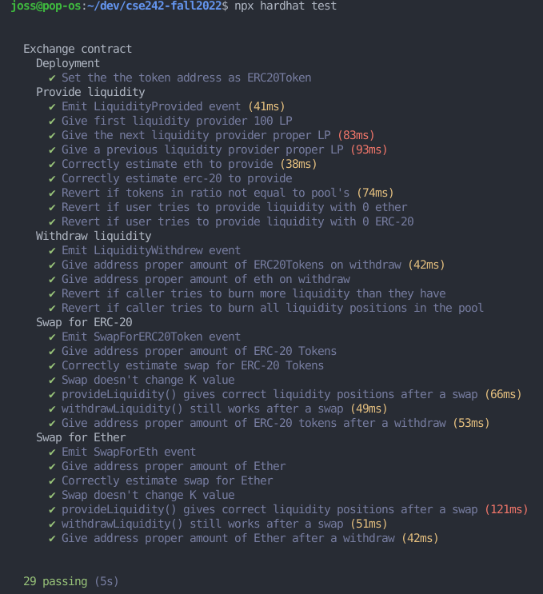

# cse242-fall2022-public
Copy of cse242-fall2022 solidity project repository without the solution file for public viewing.

# CSE242 Solidity project: SemiSwap
Similar to Uniswap v1
Factory contract and an exchange contract for each pair.  Each pair is with ETH and an ERC20.  No ERC20/ERC20 pairs or else there would be too many to grade.

# Deploying
Create .env and add private key.
Deploy Exchange.sol on lueth:
`npx hardhat run --network lueth scripts/deploy-Exchange.js`

Deploy grading tokens (AsaToken, HawKoin, KorthCoin) on lueth
`npx hardhat run --network lueth scripts/deploy-grading-tokens.js`

# Distribute tokens to students
`npx hardhat run --network lueth scripts/distribute-tokens.js`

# Testing scripts
I developed a set of unit tests for basic functionality.  You can find the tests in `test/Exchange.test.js`.  Use the tests on student's assignments as a first pass of grading, not a whole grading suite.  You'll have to check the students `Exchange.sol` after running the tests.  The tests aren't perfect, so tests could fail but the students source code has correct logic.  If all the tests pass, then the students have the correct logic for all functions and all that needs to be checked is code style and vulnerabilities.

## Running the tests
First, run the tests with the solution `Exchange.sol`:
```
$ git clone this repo
$ npm i
$ npx hardhat test
```
** Note: to run the student's tests, replace the contents of this `Exhange.sol` with the student's `Exchange.sol` and re-run `npx hardhat test`.

Output should look similar to this:



## Important notes on test setup
We didn't require for some values to be public for the student's `Exchange.sol`, like `totalLiquidityPositions`, the liquidity positions mapping, `K` value, etc.  These values are needed when running the tests so the test script can calculate the expected output values of the tests correctly.  To overcome this, I'm using a mock contract.  The mock exchange `MockExchange.sol` inherits `Exchange.sol` and adds some public getter function for viewing these potentially private values.  The tests actually create an instance of `MockExchange.sol` (rather than `Exchange.sol`) so we can use these helpful getter functions within the tests. 

However, these functions in `MockExchange.sol` use specific variables names.  It is likely that students decided to name their global variables differently than I did.  If tests fail initially, go through the student's `Exchange.sol` and re-name their variables to match the variables that `MockExchange.sol` is looking for.  In addition to re-naming variables, I included a helper function in the solution `Exchange.sol` to get the contract's Ether balance.  You'll need to paste this helper function into the student's `Exchange.sol` because the test script utilizes this function.  

Here is the function to add and the variables that might need to be renamed within the student's `Exchange.sol`:
```
address ERC20Token;
uint totalLiquidityPositions;
uint K;
mapping(address=>uint) liquidityPositions;
function _ethBalance() internal view returns(uint) {
    return address(this).balance;
}
```


# Email questions to jod323@lehigh.edu